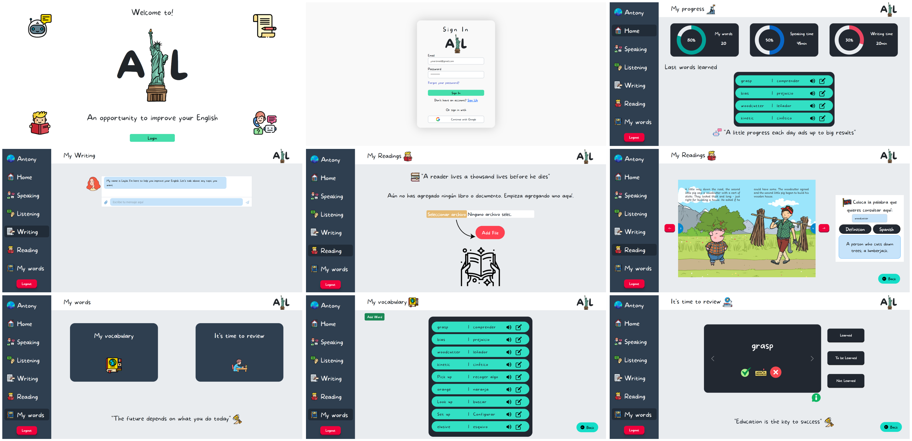

---
## Project Description
Plataforma web enfocada para mejorar nuestras habilidades en el idioma inglés mediante el uso de herramientas de inteligencia artificial y API.
Tecnologías utilizadas:
* React.js
* Firebase(Authentication , Firestore Database, Storage)
* JavaScript
* Bootstrap
---
**IMPORTANT:**
- We did not include the API KEY credentials from the Writing section in this repository, as this could compromise the security of our application or service that uses those credentials.

- Firebase has maximum request quotas for Firestore, Storage, and Authentication. It is recommended not to exceed the maximum quotas to avoid service interruptions.

